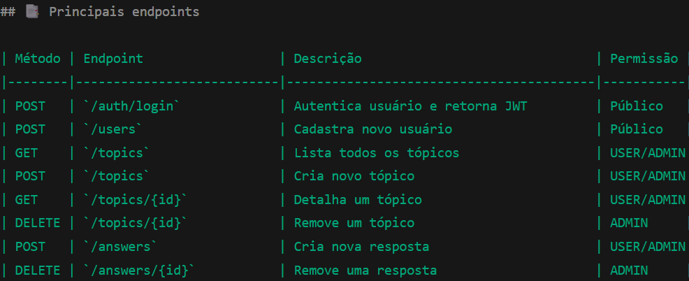

# 📚 ForumHub – API REST com Spring Boot e JWT

O **ForumHub** é uma API REST para gerenciamento de tópicos, respostas e usuários em um fórum online.  
Possui autenticação **JWT** e controle de acesso por **roles** (`ROLE_USER` e `ROLE_ADMIN`).
Este projeto contém os requisitos básicos e extras da formação ONE - Java Backend promovida pela ORACLE em parceria com a Alura. 
Ele foi Desenvolvido seguindo boas práticas de arquitetura com **DTOs**, **Services** e **Controllers**.

---
**ForunHub** contém permissões separadas seguindo o princíprio de privilégio mínimo 

## 🔒 Segurança

- **ROLE_USER** → pode criar tópicos, responder e visualizar.
- **ROLE_ADMIN** → pode excluir ou editar qualquer tópico/resposta.

---

## 🚀 Tecnologias utilizadas

- ☕ **Java 17**
- 🌱 **Spring Boot 3**
- 🗄 **Spring Data JPA**
- 🔒 **Spring Security + JWT**
- 🐬 **MySQL**
- 🛠 **Flyway** (migrations)
- 🧩 **Lombok**
- ✅ **Spring Validation**
- 📜 **Auth0 Java JWT**
- 📖 **Springdoc OpenAPI / Swagger**
- 🌙 **Insomnia**
 
 
 
 
 

# 📚 ForumHub – REST API with Spring Boot and JWT

**ForumHub** is a REST API for managing topics, replies, and users in an online forum.
It features **JWT** authentication and access control by **roles** (`ROLE_USER` and `ROLE_ADMIN`).
This project contains the basic and extra requirements of the ONE - Java Backend training, promoted by ORACLE in partnership with Alura.
It was developed following good architectural practices with **DTOs**, **Services**, and **Controllers**.

---

**ForumHub** contains separate permissions following the principle of least privilege.

## 🔒 Security

- **ROLE_USER** → can create topics, reply, and view.
- **ROLE_ADMIN** → can delete or edit any topic/reply.

---

## 🚀 Technologies Used

- ☕ **Java 17**
- 🌱 **Spring Boot 3**
- 🗄 **Spring Data JPA**
- 🔒 **Spring Security + JWT**
- 🐬 **MySQL**
- 🛠 **Flyway** 
- 🧩 **Lombok**
- ✅ **Spring Validation**
- 📜 **Auth0 Java JWT**
- 📖 **Springdoc OpenAPI / Swagger**
- 🌙 **Insomnia**
